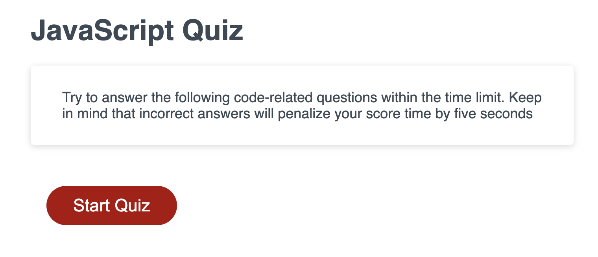
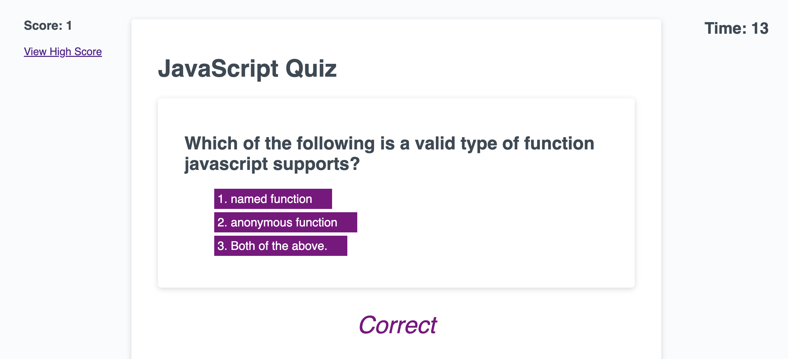
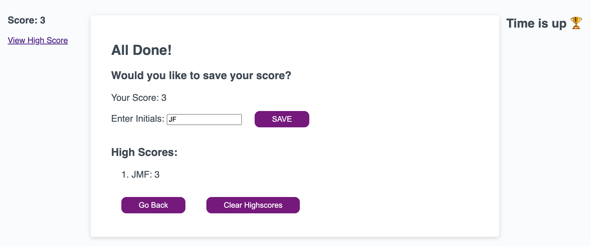

# JavaScript-Timed-Quiz
Jeremy Fulbright - JavaScrpt Timed Quiz

## Project Resources:

- [ ] [GitHub Repo](https://github.com/jfulbright/Javascript-Quiz)
- [ ] [GitHub Pages Demo](https://jfulbright.github.io/Javascript-Quiz)

***

## Description
The objective of this project was to create an javascript application for a timed coding quiz with multiple-choice questions. This app will run in the browser and will feature dynamically updated HTML and CSS powered by JavaScript code. Incorrect answers will penalize score time by five seconds. 

## Visuals
### JavaScript Quiz: 

### JavaScritp Quiz Questions:

### JavaScritp Quiz Save High Score:

## Installation
This is a single page webpage using HTML, CSS and JavaScript. It can be installed on any web server.

## Usage
This site may not be used or copied.

## Roadmap
Future Roadmap Iterations will include:
* Code Simplification, UI/UX Enhancements, Improved Error Handling

## License
See  [LICENSE](LICENSE "LICENSE") for more information.

## Project status
This deployed site is an MVP iteration where future functionality can be added. 
